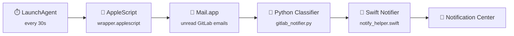

<div align="center">
  
  <h1>GitLab PR Notifier</h1>
  <p><em>Never miss a merge request again.<br>Native macOS notifications for GitLab, powered by Apple Mail.</em></p>

  [](LICENSE)
  [](https://www.apple.com/macos/)
  [](https://www.python.org/)
  [](https://swift.org/)
</div>

<br>

> [!NOTE]
> A lightweight macOS LaunchAgent that polls Apple Mail every 30 seconds for GitLab email notifications, classifies them into 12 distinct types, and delivers grouped, clickable native notifications — so you can stay on top of code reviews without keeping GitLab open.

## Features

- **Click-to-open notifications** — each notification links directly to the merge request on GitLab
- **Smart classification** — distinguishes 12 notification types (reviews, approvals, comments, mentions, and more)
- **Per-PR grouping** — notifications for the same MR stack together in Notification Center
- **Auto-archiving** — processed emails are moved to a local mailbox and cleaned up after 24 hours
- **Duplicate-proof** — state tracking ensures you never get the same notification twice
- **Zero background apps** — runs as a LaunchAgent, no menu bar clutter or Electron overhead

## How It Works



1. A macOS LaunchAgent triggers `run_notifier.sh` every 30 seconds
2. An AppleScript wrapper queries Mail.app for unread emails from `gitlab@mg.gitlab.com`
3. The Python classifier parses raw MIME sources and detects the notification type
4. A Swift helper sends native notifications via `UNUserNotificationCenter` with per-PR grouping and click-to-open
5. Processed emails are marked as read and moved to a local "Gitlab" mailbox

## Notification Types

The classifier detects notification types from subject-line suffixes and HTML body parsing:

| | Type | Trigger |
|---|------|---------|
|  | **Review Requested** | Subject `(Review requested)` or body "requested review" |
|  | **Re-Review Requested** | Subject `(Re-review requested)` |
|  | **Assigned** | Subject `(Assigned)` |
|  | **Changes Requested** | Subject `(Changes requested)` |
|  | **Comment** | Subject `(New comment)` or body "commented:" |
|  | **Comment Edited** | Body indicates an edited comment |
|  | **Approved** | Subject `(Approved)` or body "Merge request was approved" |
|  | **Merged** | Subject `(Merged)` or body "was merged" |
|  | **Closed** | Subject `(Closed)` or body "was closed" |
|  | **Mentioned** | Subject `(Mentioned)` or body contains username |
|  | **Reassigned** | Subject indicates reassignment |
| | **Pipeline Failure** | Subject contains "Failed pipeline" |
| | **Catch-all** | Any GitLab email with an MR number not matched above |

## Getting Started

### Prerequisites

- macOS with Apple Mail configured to receive GitLab email notifications
- Python 3 — `brew install python3`
- Xcode Command Line Tools — `xcode-select --install`

### Step 1: Clone & install

```bash
git clone https://github.com/danielkuhlwein/gitlab-pr-notifier.git ~/Projects/gitlab-notifier
cd ~/Projects/gitlab-notifier
chmod +x install.sh && ./install.sh
```

The installer compiles `GitlabNotifier.app` and `GitlabNotifyHelper.app`, checks dependencies, and creates the logs directory.

> [!IMPORTANT]
> This folder must be on a **local drive**, not iCloud Drive. macOS blocks LaunchAgents from accessing iCloud paths. The installer checks for this and warns you.

### Step 2: Create the LaunchAgent plist

> [!WARNING]
> **This step must be done manually from Terminal.app** (launched via <kbd>Cmd</kbd>+<kbd>Space</kbd> → "Terminal"). macOS applies `com.apple.provenance` to files created by sandboxed apps (Claude, VS Code, etc.), and `launchd` refuses to run provenance-tainted plists.

<details>
<summary><strong>Expand to see the plist command</strong></summary>

<br>

Replace `<YOUR_PATH>` with the absolute path to this project folder, then paste into Terminal:

```bash
cat > ~/Library/LaunchAgents/com.daniel.gitlab-notifier.plist <<'EOF'
<?xml version="1.0" encoding="UTF-8"?>
<!DOCTYPE plist PUBLIC "-//Apple//DTD PLIST 1.0//EN"
  "http://www.apple.com/DTDs/PropertyList-1.0.dtd">
<plist version="1.0">
<dict>
    <key>Label</key>
    <string>com.daniel.gitlab-notifier</string>
    <key>ProgramArguments</key>
    <array>
        <string>/bin/bash</string>
        <string><YOUR_PATH>/run_notifier.sh</string>
    </array>
    <key>WorkingDirectory</key>
    <string><YOUR_PATH></string>
    <key>StartInterval</key>
    <integer>30</integer>
    <key>RunAtLoad</key>
    <true/>
    <key>EnvironmentVariables</key>
    <dict>
        <key>PATH</key>
        <string>/opt/homebrew/bin:/usr/local/bin:/usr/bin:/bin:/usr/sbin:/sbin</string>
    </dict>
    <key>StandardOutPath</key>
    <string><YOUR_PATH>/logs/launchd_stdout.log</string>
    <key>StandardErrorPath</key>
    <string><YOUR_PATH>/logs/launchd_stderr.log</string>
    <key>ThrottleInterval</key>
    <integer>10</integer>
    <key>KeepAlive</key>
    <false/>
</dict>
</plist>
EOF
```

Verify no provenance was applied:

```bash
xattr -l ~/Library/LaunchAgents/com.daniel.gitlab-notifier.plist
# Should show nothing (or just com.apple.macl). NOT com.apple.provenance.
```

Load the agent:

```bash
launchctl bootstrap gui/$(id -u) ~/Library/LaunchAgents/com.daniel.gitlab-notifier.plist
```

</details>

### Step 3: Verify

```bash
sleep 35 && launchctl list com.daniel.gitlab-notifier | grep LastExitStatus
```

`LastExitStatus` should be `0`. If macOS asks whether "GitlabNotifier" can control Mail.app, click **Allow**.

## Configuration

> [!TIP]
> Edit the variables at the top of `gitlab_notifier.py` to match your GitLab setup.

| Variable | Default | Description |
|----------|---------|-------------|
| `MY_NAME` | `"Daniel Kuhlwein"` | Used to detect when you're the PR author |
| `MY_GITLAB_USERNAME` | `"daniel-kuhlwein"` | Used to detect @-mentions |
| `GITLAB_EMAIL_SENDER` | `"gitlab@mg.gitlab.com"` | Email sender to filter on |
| `EMAIL_LOOKBACK_HOURS` | `2` | How far back to scan for emails |
| `GITLAB_MAILBOX` | `"Gitlab"` | Local Mail.app mailbox name |
| `GITLAB_FOLDER_TTL_HOURS` | `24` | How long emails stay before auto-archiving |

<details>
<summary><strong>Debugging</strong></summary>

<br>

```bash
# Watch logs in real time
tail -f logs/wrapper.log logs/notifier.log

# Enable verbose DEBUG logging for a manual run
GITLAB_NOTIFIER_DEBUG=1 ./run_notifier.sh

# Check launchd system log for errors
log show --predicate 'sender == "launchd" AND composedMessage CONTAINS "gitlab"' --last 5m --style compact

# Check for posix_spawn / permission errors
log show --predicate 'sender == "launchd" AND messageType == 16' --last 5m --style compact | grep gitlab

# Manual run (bypasses launchd entirely)
./run_notifier.sh
```

To enable debug logging permanently, add this to the plist's `EnvironmentVariables` dict (you'll need to recreate the plist from a clean Terminal):

```xml
<key>GITLAB_NOTIFIER_DEBUG</key>
<string>1</string>
```

</details>

## Testing

```bash
python3 test_classifier.py
```

Runs 18 test cases covering all observed email types (including MIME-encoded bodies) and URL extraction.

## Uninstall

```bash
./install.sh --uninstall
```

<details>
<summary><strong>Project Structure</strong></summary>

<br>

```
.
├── install.sh                          # Installer (builds apps, checks deps, reloads agent)
├── run_notifier.sh                     # LaunchAgent wrapper (absorbs applet exit codes)
├── wrapper.applescript                 # AppleScript source — queries Mail.app
├── gitlab_notifier.py                  # Python classifier + notification dispatcher
├── notify_helper.swift                 # Swift notification sender (UNUserNotificationCenter)
├── com.daniel.gitlab-notifier.plist    # LaunchAgent template (reference only)
├── test_classifier.py                  # Test suite for the email classifier
├── icons/                              # Notification icons + app icon
│   └── app_ico.png                     # App icon (embedded by install.sh)
├── CLAUDE.md                           # AI assistant instructions
└── .gitignore
```

</details>

## License

[MIT](LICENSE) — do whatever you want with it.
